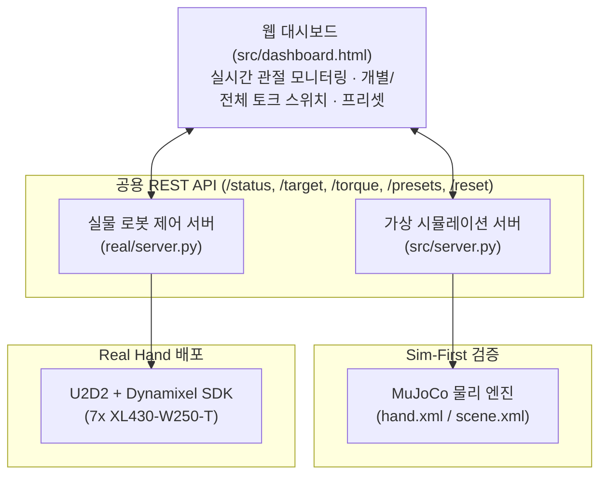

# tri_hand: Sim-to-Real 로봇 핸드 제어

3지 다관절 로봇 손(`tri_hand`)을 위한 Sim-to-Real 제어 프로젝트입니다.

**MuJoCo 물리 시뮬레이션을 먼저 구축하여 기구학·동역학 및 제어 로직을 선행 검증(Sim-First)** 했습니다. 이후 검증된 가상 모델을 기반으로 **동일한 제어 인터페이스(HTTP API & 웹 대시보드)를 통해 실물 로봇(Real Hand, Dynamixel XL430)까지 연결 및 동작 검증을 완료**했습니다.

가상 시뮬레이션 환경에서의 안전한 테스트부터 실물 로봇 손의 정밀 구동까지 코드와 UI 변경 없이 매끄럽게 전환할 수 있습니다.

| MuJoCo 시뮬레이션 (Sim-First 검증) | 실물 로봇 손 (Real Hand 검증) |
| :---: | :---: |
|  | *(실물 로봇 구동 영상/데모 추가 예정)* |

---

## 🏛 프로젝트 아키텍처

시뮬레이션(`src/server.py`)과 실물 로봇(`real/server.py`)이 **동일한 REST API 규격과 웹 대시보드**를 공유하므로, 가상 환경에서 검증한 자세·프리셋·제어 로직을 실물 로봇에 즉시 투입할 수 있습니다.



---

## ✨ 핵심 기능 (Key Features)

* **3D 물리 시뮬레이션 (MuJoCo)**
  - 3지 7자유도 로봇 손의 정밀 기구학/동역학 모델링 (`hand.xml`, `scene.xml`)
  - 시각용 메쉬(STL)와 충돌용 지오메트리(Primitive) 분리로 빠르고 안정적인 물리 연산
  - 단계별 MuJoCo 모델링 학습을 위한 `tutorial/` 예제 코드 포함
* **실물 로봇 하드웨어 인터페이스 (`real/`)**
  - U2D2 인터페이스 및 `dynamixel-sdk`를 통한 7개 모터 동시 제어
  - **하드웨어 진단 도구 (`real/check.py`)**: 전 보레이트 자동 스캔, 영점/방향 실시간 모니터링, 전압·온도·동작 모드 무결성 점검
  - **안전 기능 내장**: 가동 범위 초과 관절 토크 보호(409), 서버 시작 시 부드러운 0 rad 안전 Homing (0.5 rad/s)
* **통합 웹 대시보드 & 프리셋 시스템**
  - 관절 7개 실시간 각도, 목표 각도, 각속도, 토크, 게인 모니터링 (0.2초 주기 갱신)
  - 원클릭 전체 토크 제어 및 관절별 독립 토크 스위치
  - 모터 7개의 자세와 게인을 JSON 파일로 영구 저장/불러오기 가능한 프리셋 기능

---

## 🚀 빠른 시작 (Quick Start)

가상 시뮬레이션과 실물 로봇 중 원하는 환경을 선택하여 바로 실행할 수 있습니다.

### Mode A: 가상 시뮬레이션 (Simulation)

```bash
# 1) 웹 대시보드와 함께 시뮬레이션 실행 (헤드리스 모드)
python src/server.py --headless

# 2) 브라우저에서 접속
# http://127.0.0.1:8000
```

> **3D 뷰어(GUI)로 직접 확인하고 싶은 경우**:
> - **macOS**: `mjpython src/run_sim.py`
> - **Linux GUI**: `python src/run_sim.py`
> - **WSL2 / 서버**: 디스플레이 드라이버 이슈 방지를 위해 `--headless` 권장 (`python src/run_sim.py --headless`)

### Mode B: 실물 로봇 손 제어 (Real Robot)

U2D2를 PC에 연결하고 모터 12V 전원을 인가한 후 실행합니다.

```bash
# 1) 실물 연결 및 모터 상태 점검
python real/check.py

# 2) 실물 제어 서버 실행 (안전 Homing 후 대시보드 오픈)
python real/server.py

# 3) 브라우저에서 동일하게 접속하여 제어
# http://127.0.0.1:8000
```

---

## 🛠 환경 세팅 (Setup)

권장 파이썬 버전은 **Python 3.10**이며, 빠르고 격리된 환경 구축을 위해 [`uv`](https://github.com/astral-sh/uv) 사용을 권장합니다.

```bash
# 1) uv 설치 (설치되어 있지 않은 경우)
curl -LsSf https://astral.sh/uv/install.sh | sh
source ~/.local/bin/env

# 2) Python 3.10 가상환경 생성 및 활성화
uv python install 3.10
uv venv ~/mujoco_env --python 3.10
source ~/mujoco_env/bin/activate

# 3) 의존성 패키지 설치
uv pip install -r requirements.txt
```

<details>
<summary><b>기타 OS별 참고 사항</b></summary>

* **Linux (Ubuntu/Debian) `apt` 사용 시**:
  ```bash
  sudo apt update && sudo apt install -y python3.10 python3.10-venv
  python3.10 -m venv ~/mujoco_env
  source ~/mujoco_env/bin/activate
  pip install -r requirements.txt
  ```
* **macOS (Homebrew)**:
  `brew install python@3.10` 후 동일하게 가상환경을 생성합니다. MuJoCo GUI 창을 띄울 때는 macOS의 스레드 특성상 `mjpython`을 사용해야 합니다.
* **Windows (WSL2)**:
  Windows 호스트가 아닌 **WSL2(Ubuntu)** 내부에서 위 `uv` 가이드대로 설치합니다. 실물 U2D2 연결 시 `usbipd`를 통해 USB 포트를 WSL2에 바인딩해야 `/dev/ttyUSB*`로 인식됩니다.
</details>

---

## 🤖 실물 하드웨어 연결 및 캘리브레이션 가이드

실물 로봇 손의 모터 ID, 통신 속도, 회전 방향(`sign`), 영점(`zero`)은 [`real/config.json`](file:///home/erdos/workspace/tri-hand/real/config.json)에서 관리합니다.

### 캘리브레이션 5단계

1. **하드웨어 연결 및 자동 스캔**
   모터 전원(12V)과 U2D2를 연결하고 실행합니다. 응답이 없는 모터가 있으면 자동으로 전 보레이트(57600 ~ 4000000)를 스캔합니다.
   ```bash
   python real/check.py
   ```
2. **영점(zero) 및 회전 방향(sign) 확인**
   손가락을 손으로 천천히 움직여 각 관절의 ID 배정과 0점 tick을 확인합니다.
   ```bash
   python real/check.py --watch
   ```
   - 손가락을 완전히 편 상태(0 rad)의 tick 값을 `real/config.json`의 `zero`에 입력합니다 (기본 2048).
   - 오므림 회전 시 tick이 감소하면 `sign: -1`로 반전시킵니다. (오므림 기준: A는 음수, B/C는 양수)
3. **설정 무결성 재점검**
   ```bash
   python real/check.py
   ```
   모든 모터가 정상 응답하고 "관절 범위 밖" 경고가 없는지 확인합니다.
4. **실물 제어 서버 구동**
   ```bash
   python real/server.py
   ```
   서버 시작 시 전 관절 토크가 켜지며 0.5 rad/s 속도로 안전하게 0 rad 위치로 정렬됩니다. (`--no-home` 옵션으로 생략 가능)
   대시보드(`http://127.0.0.1:8000`)에서 관절을 하나씩 조작하며 동작을 확인합니다.
5. **종료**
   `Ctrl+C`를 누르면 모든 모터의 토크가 안전하게 꺼지며 종료됩니다.

---

## 🖥 웹 대시보드 & 프리셋 제어 상세

`src/server.py`(시뮬레이션)와 `real/server.py`(실물)는 같은 대시보드([src/dashboard.html](file:///home/erdos/workspace/tri-hand/src/dashboard.html))를 통해 다음 기능을 제공합니다.

* **실시간 모니터링**: 7개 모터(`A_j0`, `A_j1`, `A_j2`, `B_j1`, `B_j2`, `C_j1`, `C_j2`)의 현재 각도, 목표 각도, 속도, 토크, 게인 값 표출
* **원격 LAN 접속**: `--host 0.0.0.0`으로 실행 시 동일 공유기(LAN) 내의 다른 기기/태블릿에서 `http://<호스트IP>:8000`으로 접속 제어 가능
* **프리셋 시스템**:
  1. 원하는 각도 및 게인을 입력하고 이름을 지정해 프리셋으로 저장 (시뮬레이션: `src/presets.json`, 실물: `real/presets.json`)
  2. 드롭다운에서 프리셋 선택 후 **적용**을 누르면 전 관절에 일괄 반영

### 입력 허용 범위 및 제어 스펙

| 항목 | 허용 범위 | 비고 |
|---|---|---|
| **목표 각도** | `A_j0`: ±1.0472 rad (±60°)<br>`A_j1~2, B_j1~2, C_j1~2`: ±1.5708 rad (±90°) | 관절 기구학 동작 범위 (`ctrlrange`) |
| **kp (P 게인)** | 0 초과 ~ 100 | 실물은 XL430 Position P Gain 레지스터 직접 매핑 |
| **kv (D 게인)** | 0 ~ 5 | 실물은 XL430 Position D Gain 레지스터 직접 매핑 |
| **토크 한계** | 0 초과 ~ 1.4 N·m | XL430-W250-T 정격 토크 기준 |

---

## ⚙️ 기구학 및 하드웨어 사양 (Kinematics Specs)

* **서보 모터**: Robotis Dynamixel XL430-W250-T (7 DOF)
* **최대 토크**: `1.4 N·m` (`forcerange="-1.4 1.4"`)
* **좌표계 및 중력축**:
  - 중력 방향: **`-Y` 축** (`gravity="0 -9.81 0"`)
  - 관절 회전축: **`+X` 축** (`axis="1 0 0"`)
* **오므림(Grasp/Close) 회전 부호 규칙**:
  - **Finger A (상단 3자유도)**: 음수(`-`) 방향 회전이 오므림
  - **Finger B, C (하단 2자유도)**: 양수(`+`) 방향 회전이 오므림

---

## 📁 프로젝트 구조

```
tri_hand/
├── docs/               # 이론 배경 학습 자료 및 데모 미디어
├── src/                # [가상 시뮬레이션] 모델 및 제어 환경
│   ├── scene.xml       # 전체 시뮬레이션 씬 (바닥, 조명 등)
│   ├── hand.xml        # 로봇 손 기구학/동역학 MuJoCo 모델
│   ├── meshes/         # 3D STL 메쉬 파일
│   ├── run_sim.py      # MuJoCo 뷰어 실행 스크립트
│   ├── server.py       # 시뮬레이션 HTTP 제어 서버
│   └── dashboard.html  # 통합 웹 대시보드 (Sim / Real 공용)
├── real/               # [실물 로봇 제어] U2D2 + XL430 하드웨어 환경
│   ├── config.json     # 모터 ID, 통신 속도, zero, sign, 관절 범위 설정
│   ├── config.py       # 하드웨어 설정 로더 및 유효성 검증
│   ├── dxl.py          # Dynamixel SDK 래퍼 (tick ↔ rad 변환)
│   ├── check.py        # 하드웨어 무결성 점검 / 보레이트 스캔 / 각도 모니터
│   └── server.py       # 실물 로봇 HTTP 제어 서버 (대시보드 공용)
├── tests/              # API 및 제어 로직 유닛 테스트 (pytest)
├── tutorial/           # MuJoCo 모델링 기초 단계별 실습 예제
├── AGENTS.md           # 에이전트 작업 지침 및 하드웨어 모델링 원칙
├── requirements.txt    # 크로스 플랫폼 의존성 목록
└── README.md           # 프로젝트 안내서
```

---

## 🧪 테스트 실행

```bash
pip install pytest httpx
python -m pytest tests
```
